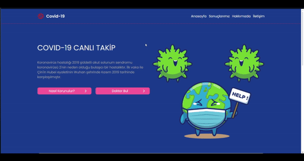

# COVID Map Projesi

Bu proje, React ve Redux Toolkit kullanarak geliştirilmiş bir COVID harita uygulamasıdır. Kullanıcılar dünya haritası üzerinde herhangi bir ülkeye tıklayarak o ülkenin COVID-19 detaylarına ulaşabilirler. Harita görselleştirmesi için `react-simple-maps` kütüphanesi kullanılmıştır ve dinamik yapılar birim testleri ile doğrulanmıştır.

## İçindekiler
- [Özellikler](#özellikler)
- [Kullanılan Teknolojiler](#kullanılan-teknolojiler)
- [Kurulum](#kurulum)
- [Kullanım](#kullanım)
- [Projede Kullanılan Komutlar](#projede-kullanılan-komutlar)
- [Katkıda Bulunma](#katkıda-bulunma)
- [Lisans](#lisans)

## Özellikler

- **Harita Tabanlı COVID Bilgisi:** Kullanıcılar dünya haritası üzerinden bir ülkeye tıklayarak o ülkeye ait COVID verilerini görüntüleyebilir.
- **Redux Toolkit ile Durum Yönetimi:** Tüm uygulama durumu Redux Toolkit ile yönetilmektedir.
- **Test Edilmiş Dinamik Yapılar:** Projenin dinamik özellikleri için birim testler yazılmıştır ve başarıyla geçmiştir.
- **Kapsamlı ve Kullanıcı Dostu Arayüz:** Basit ve sezgisel bir kullanıcı deneyimi sunar.

## Kullanılan Teknolojiler

- **React** - UI bileşenleri oluşturmak için
- **Redux Toolkit** - Durum yönetimi
- **react-simple-maps** - Harita görselleştirmesi
- **Jest** - Unit test framework’ü
- **Testing Library** - React bileşenlerinin test edilmesi

## Kurulum

Projeyi çalıştırmak için aşağıdaki adımları izleyin:

1. Bu projeyi bilgisayarınıza klonlayın:
   ```bash
   git clone https://github.com/cengo14/react-covid-map-project.git
   ```

2. Proje dizinine gidin:
   ```bash
   cd react-covid-map-project
   ```

3. Gerekli bağımlılıkları yükleyin:
   ```bash
   npm install
   ```

## Kullanım

Projeyi yerel sunucuda başlatmak için aşağıdaki komutu çalıştırın:

```bash
npm start
```

`http://localhost:3000` adresine giderek uygulamayı görüntüleyebilirsiniz.

## Ekran Görüntüsü




1. **Ülke Seçimi:** Harita üzerinde herhangi bir ülkeye tıklayın.
2. **COVID Bilgilerini Görüntüleme:** Seçilen ülkeye ait COVID detayları ekranda görünecektir.

## Projede Kullanılan Komutlar

- **Proje Başlatma:** `npm start` - Projeyi yerel sunucuda başlatır.
- **Test Çalıştırma:** `npm test` - Unit testleri çalıştırır.
- **Build:** `npm run build` - Projeyi production için derler.

## Katkıda Bulunma

Bu projeye katkıda bulunmak isterseniz, lütfen bir **pull request** açın veya bir **issue** açarak önerilerinizi paylaşın.

## Lisans

Bu proje [MIT Lisansı](https://opensource.org/licenses/MIT) ile lisanslanmıştır.

---

Umarım README dosyası işinize yarar! Başka bir konuda yardıma ihtiyaç duyarsanız buradayım. 😊
